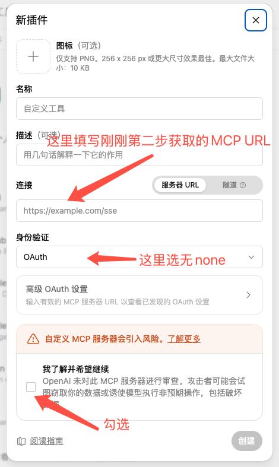

# LocalMCP - 榨干 ChatGPT 的所有价值

让 ChatGPT 网页端使用你的本机开发能力：文件操作、Shell、持久进程、Skills 和可插拔 MCP Server。


本机主动通过 WebSocket 连接 Cloudflare Worker，由 Worker 负责认证与请求中继，无需公网 IP 或开放入站端口。

## 快速开始

默认使用公共中继服务，无需自建 Worker。

### 第一步：准备环境

- 安装 **Node.js 22+**，在终端运行 `node -v` 确认版本。
- 准备 ChatGPT 账号。

### 第二步：安装并启动 LocalMCP

打开终端，依次执行：

```sh
npm install -g @daodao97/localmcp
localmcp
```

看到 `Status: running` 后，复制 `MCP URL:` 后的**完整地址**。可随时运行 `localmcp status` 再次查看。

> MCP URL 包含访问凭证，请勿公开。服务在后台运行，使用时保持电脑开机、联网即可。

### 第三步：开启 ChatGPT 开发者模式

登录 ChatGPT，在 **设置 → 安全与登录** 中开启 **开发者模式**：[点我打开设置](https://chatgpt.com/#settings/Security?section=developer-mode)。


### 第四步：在 ChatGPT 中添加 LocalMCP

[点我新建插件](https://chatgpt.com/plugins#settings/Connectors?create-connector=true&redirectAfter=%2Fplugins)，填写后创建：

| 字段 | 填写内容 |
| --- | --- |
| 名称 | `LocalMCP` |
| 描述（如需） | 连接本机文件和开发工具 |
| 服务器 URL | 第二步复制的完整 MCP URL |
| 身份验证 | **None（无）** |



### 第五步：开始使用

在个人插件中安装 LocalMCP，回到首页新建对话。输入 `@` 选择 **LocalMCP**，发送：

> 请列出本机工作区的路径和根目录下的文件，不修改任何内容。

如出现工具调用确认，核对后允许。返回本机目录列表即连接成功。

<details>
<summary>遇到问题？</summary>

- **找不到 `localmcp` 命令**：确认安装成功，再重新打开终端。
- **启动失败**：运行 `localmcp status`，查看 `Log:` 指向的日志。
- **ChatGPT 无法连接**：确认本机服务已启动、网络正常，URL 复制完整，身份验证为 **None**。
- **找不到开发者模式或插件**：检查账号权限，确认插件已安装，并新建对话。操作入口见 [OpenAI 官方说明](https://developers.openai.com/plugins/quickstart/)。

</details>

## 常用命令

| 命令 | 用途 |
| --- | --- |
| `localmcp` | 启动后台服务，已运行时复用已有进程 |
| `localmcp status` | 查看状态、MCP URL 和日志路径 |
| `localmcp stop` | 停止后台服务 |
| `localmcp reload` | 校验并重新加载配置 |
| `localmcp agent` | 前台运行，便于调试 |

日志：`~/.localmcp/agent.log`。停止服务或重启电脑后，运行 `localmcp` 即可重新启动。

## 高阶用法：自建 Worker（可选）

需要自己的中继服务时，准备 Cloudflare 和 GitHub 账号，按以下步骤部署。使用公共中继可跳过本节。

本节终端命令适用于 macOS / Linux。

### 第一步：部署到 Cloudflare

[](https://deploy.workers.cloudflare.com/?url=https://github.com/daodao97/localmcp)

点击按钮，按提示登录、连接 GitHub、创建仓库并点击 **Deploy**。数据库和密钥自动配置，详见 [Cloudflare 官方说明](https://developers.cloudflare.com/workers/platform/deploy-buttons/)。

部署后，在 Worker 的 **Settings → Domains & Routes** 中复制 `workers.dev` 地址，例如 `https://localmcp-relay.YOUR-SUBDOMAIN.workers.dev`。

<details>
<summary>通过命令行部署</summary>

```sh
git clone https://github.com/daodao97/localmcp.git
cd localmcp
npm ci
npx wrangler login
npm run worker:deploy
```

复制输出中的 Worker 地址，继续下一步。

</details>

### 第二步：连接本机

已使用过 LocalMCP 的用户，先停止服务并备份旧凭证。已有凭证时，仅设置新地址不会切换 Worker。

```sh
localmcp stop
mv ~/.localmcp/worker.json ~/.localmcp/worker.json.backup-$(date +%Y%m%d%H%M%S)
```

首次使用只需先安装 `npm install -g @daodao97/localmcp`；没有 `worker.json` 时跳过备份。

将示例地址替换为第一步的 Worker 地址，启动服务：

```sh
LOCALMCP_WORKER_URL=https://localmcp-relay.YOUR-SUBDOMAIN.workers.dev localmcp
```

连接成功后会输出新的 MCP URL，并将凭证保存到 `~/.localmcp/worker.json`。以后直接运行 `localmcp`，无需重复设置地址或运行 `worker:setup`、`worker:secrets`。

### 第三步：更新 ChatGPT 连接

运行 `localmcp status`，复制新的完整 MCP URL，按[快速开始第四步](#第四步在-chatgpt-中添加-localmcp)创建新插件，再按[第五步](#第五步开始使用)验证调用。可命名为 `LocalMCP-自建`，原插件不会自动切换地址。

<details>
<summary>检查 Worker 状态</summary>

替换为你的 Worker 域名后执行：

```sh
curl https://localmcp-relay.YOUR-SUBDOMAIN.workers.dev/healthz
# 预期：{"ok":true,"service":"localmcp-relay","registration":true}
```

此结果表示中继可用，本机连接仍需通过 ChatGPT 调用验证。

</details>

## 配置与扩展

### 工作区与工具开关

首次启动会创建 `~/.localmcp/localmcp.json`，默认工作区为用户主目录（`~`），开启文件、Shell 和持久进程工具。

用文本编辑器打开配置，将示例路径替换为已有的项目目录。Windows 路径可写成 `C:/Users/你的用户名/code/project`。

```json
{
  "workspaces": {
    "project": "/Users/me/code/project"
  },
  "defaultWorkspace": "project",
  "features": {
    "files": true,
    "shell": true,
    "processes": true
  },
  "skills": {
    "dir": "skills",
    "enabled": ["local-development"]
  },
  "mcpServers": {}
}
```

- **多工作区**：在 `workspaces` 中添加路径，调用工具时用 `workspace` 选择，省略时使用默认工作区。
- **工具开关**：在 `features` 中用 `true` / `false` 启用或关闭工具；持久进程依赖 Shell 开启。
- **Skills**：将说明放入 `~/.localmcp/skills/<名称>/SKILL.md`，在 `skills.enabled` 中启用。

完整示例见 [localmcp.example.json](localmcp.example.json)。可通过 `LOCALMCP_CONFIG` 指定其他配置文件。

### 外部 MCP 服务

在 `mcpServers` 中添加服务。例如，已安装 `cua-driver` 时，可加入以下 Computer Use 配置：

```json
{
  "mcpServers": {
    "computer": {
      "enabled": true,
      "command": "cua-driver",
      "args": ["mcp"]
    }
  }
}
```

外部 MCP 通过三个固定工具发现和调用：

| 工具 | 用途 |
| --- | --- |
| `list_mcp_servers` | 列出已加载的服务 |
| `list_mcp_tools` | 查询指定 `server` 的工具及参数 |
| `call_mcp_tool` | 传入 `server`、`tool` 和 `arguments` 调用工具 |

例如，先用 `list_mcp_tools({"server":"computer"})` 查看参数，再用 `call_mcp_tool({"server":"computer","tool":"list_apps","arguments":{}})` 调用。服务端校验参数并保留图片、结构化结果和错误状态；统一入口可能执行写入、命令及网络操作。

### 配置生效与重载

主配置保存后约一秒自动生效，无需手动重载。更新失败时保留旧配置，错误写入日志。

| 修改内容 | 生效方式 |
| --- | --- |
| 主配置（含 `LOCALMCP_CONFIG` 指定的文件） | 自动更新；不重启 Agent、不改变 MCP URL、不打断当前调用或已有进程 |
| `SKILL.md` 文件内容 | 在本机终端运行 `localmcp reload` |
| Worker 地址或凭证 | 停止后重新启动；切换 Worker 见上一节 |

关闭 Shell 或持久进程工具只限制后续调用，不会终止已有进程。`localmcp reload` 会重启内部服务，请在本机终端执行，不要通过 LocalMCP 的 `run_command` 调用。

MCP 配置更新后，用 `list_mcp_servers` / `list_mcp_tools` 查看；Skills 更新后，用 `list_skills` / `read_skill` 查看。外部 MCP 和 Skills 的变化不会改变顶层工具列表，内置工具开关会改变该列表。

<details>
<summary>从旧版迁移</summary>

升级到固定工具入口后，刷新客户端工具列表并新建会话。旧的 `<server>_<tool>` 调用已不支持，请改用 `call_mcp_tool`。

npm 升级不会覆盖已有的 `~/.localmcp/skills/`，其中引用旧工具名的说明需同步修改。

</details>

### 其他连接方式

**stdio**：供支持该协议的 MCP 客户端使用。

```sh
localmcp stdio
```

**本地 HTTP**：将占位文字替换为至少 32 字符的密钥后，在 macOS / Linux 终端执行：

```sh
LOCALMCP_TOKEN='替换为至少32字符的密钥' localmcp http
```

## 开发

修改源码时使用；普通使用无需执行。

### 第一步：获取源码

```sh
git clone https://github.com/daodao97/localmcp.git
cd localmcp
npm ci
```

### 第二步：检查与构建

```sh
npm run check
npm test
npm run build
```

## License

MIT
