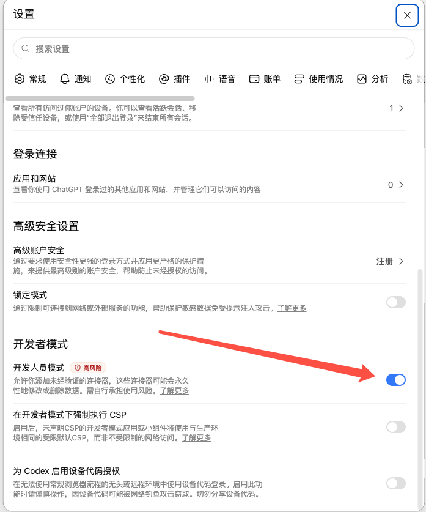

# LocalMCP - 榨干 ChatGPT 的所有价值

让 ChatGPT 网页端使用你的本机开发能力：文件操作、Shell、持久进程、Skills 和可插拔 MCP Server。


本机主动通过 WebSocket 连接 Cloudflare Worker，由 Worker 负责认证与请求中继，无需公网 IP 或开放入站端口。

## 快速开始

第一次使用，按下面 5 步操作即可。默认使用公共 Worker（连接 ChatGPT 和本机的中继服务），无需准备服务器、Cloudflare 账号或下载本项目源码。

### 第一步：准备环境

在电脑上安装 **Node.js 22 或更高版本**，并准备可以开启开发者模式的 ChatGPT 账号。

打开终端（macOS 的“终端”或 Windows 的 PowerShell），执行：

```sh
node -v
npm -v
```

`node -v` 应显示 `v22` 或更高版本，`npm -v` 应显示版本号。如果提示找不到命令，先安装 Node.js，再重新打开终端。

### 第二步：安装并启动 LocalMCP

在终端中依次执行：

```sh
npm install -g @daodao97/localmcp
localmcp
```

首次启动会自动创建 `~/.localmcp/` 配置、注册独立设备，并在后台启动服务。成功后，终端会显示 `Status: running` 和 `MCP URL:`。

复制 `MCP URL:` 后面的**完整地址**，下一步连接时需要用到。地址包含 `/mcp/<设备ID>/<密钥>`，不要只复制域名。忘记复制时，可以重新执行：

```sh
localmcp status
```

> 完整 MCP URL 包含访问凭证，请勿公开分享或提交到 Git。

关闭终端不会停止服务；使用期间请保持这台电脑开机、联网。默认工作区是当前用户的主目录（`~`），默认开启文件、Shell 和持久进程工具；要指定项目目录，可在完成连接后查看[配置与扩展](#配置与扩展)。

### 第三步：开启 ChatGPT 开发者模式

在浏览器中登录 ChatGPT，打开 **设置 → 安全与登录 → 开发者模式** 并开启，也可以[点我打开设置](https://chatgpt.com/#settings/Security?section=developer-mode)。



### 第四步：在 ChatGPT 中添加 LocalMCP

打开 ChatGPT 的插件页面，点击新增按钮，也可以[点我新建插件](https://chatgpt.com/plugins#settings/Connectors?create-connector=true&redirectAfter=%2Fplugins)。按下面的内容填写：

| 字段 | 填写内容 |
| --- | --- |
| 名称 | `LocalMCP` |
| 描述（如需填写） | 连接本机文件和开发工具 |
| 服务器 URL | 第二步复制的完整 MCP URL |
| 身份验证 | **None（无）** |

按页面提示完成创建，等待 ChatGPT 读取工具列表。


### 第五步：发起第一次调用

在个人插件中找到 LocalMCP，如页面显示安装按钮，先完成安装。回到 ChatGPT 首页，切换到 **Work**，新建对话，在输入框键入 `@` 并选择 **LocalMCP**，然后发送：

> 请查看我的本机工作区信息，并列出工作区根目录下的文件和文件夹，不修改任何文件。

如果 ChatGPT 显示工具调用确认，核对后允许执行。能返回本机工作区路径和目录列表，就说明连接成功，可以开始使用了。

ChatGPT 的操作入口可参照 [OpenAI 官方快速开始](https://developers.openai.com/plugins/quickstart/)。

<details>
<summary>没有成功？按这里检查</summary>

- **提示找不到 `localmcp` 命令**：先确认安装命令成功，再重新打开终端执行 `localmcp`。
- **启动失败或没有 MCP URL**：执行 `localmcp status` 查看状态，并打开输出中 `Log:` 指向的日志文件（默认 `~/.localmcp/agent.log`）查看错误。
- **ChatGPT 无法连接**：确认本机已启动 LocalMCP、电脑保持联网，服务器 URL 与 `localmcp status` 输出完全一致，身份验证选择了 **None**。
- **找不到开发者模式或插件入口**：确认登录的账号及所在工作区允许使用开发者模式。
- **对话中找不到 LocalMCP**：确认插件已创建并安装，在 Work 中新建对话，再输入 `@` 选择。

</details>

## 常用命令

```sh
localmcp          # 启动后台服务，重复执行会复用已有进程
localmcp status   # 查看状态、MCP URL 和日志路径
localmcp stop     # 停止后台服务
localmcp reload   # 校验并重新加载配置
localmcp agent    # 前台运行，便于调试
```

日志位于 `~/.localmcp/agent.log`。停止服务后，再次运行 `localmcp` 即可启动；电脑重启后也可用这条命令启动。

## 高阶用法：自建 Worker（可选）

完成快速开始后，如果希望使用自己的中继服务，可以按本节操作。需要 Cloudflare 和 GitHub 账号；继续使用公共 Worker 可以跳过本节。

以下终端命令使用 macOS / Linux 的 Shell 语法。

### 1. 部署到 Cloudflare

[](https://deploy.workers.cloudflare.com/?url=https://github.com/daodao97/localmcp)

点击按钮，按提示登录、连接 GitHub 并创建仓库，然后点击 **Deploy**。Cloudflare 会根据仓库配置部署 Worker 和 SQLite Durable Object，无需手动创建数据库或填写密钥。按钮流程见 [Cloudflare 官方说明](https://developers.cloudflare.com/workers/platform/deploy-buttons/)。

部署成功后，在 Worker 的 **Settings → Domains & Routes** 中复制 `workers.dev` 地址，例如 `https://localmcp-relay.YOUR-SUBDOMAIN.workers.dev`。

<details>
<summary>也可以通过命令行部署</summary>

```sh
git clone https://github.com/daodao97/localmcp.git
cd localmcp
npm ci
npx wrangler login
npm run worker:deploy
```

复制命令输出中的 Worker 地址，然后继续下面的连接步骤。

</details>

### 2. 将本机切换到自己的 Worker

如果已经按快速开始启动过 LocalMCP，先停止服务，再备份旧的连接凭证：

```sh
localmcp stop
mv ~/.localmcp/worker.json ~/.localmcp/worker.json.backup-$(date +%Y%m%d%H%M%S)
```

如果是首次使用，请先完成快速开始中的安装命令；尚未生成 `worker.json` 时，跳过上面的备份命令。

将下面的示例地址替换成第一步复制的 Worker 地址，再执行：

```sh
LOCALMCP_WORKER_URL=https://localmcp-relay.YOUR-SUBDOMAIN.workers.dev localmcp
```

连接成功后会输出新的 MCP URL。地址和凭证会保存到 `~/.localmcp/worker.json`，以后直接运行 `localmcp` 即可，无需重复设置环境变量，也无需运行 `worker:setup` 或 `worker:secrets`。

注意：已有 `worker.json` 时会复用其中的连接信息，仅修改环境变量不会切换 Worker，因此上面的停止和备份步骤不能省略。

### 3. 在 ChatGPT 中连接新的地址

运行 `localmcp status`，复制新的完整 MCP URL，按[快速开始第四步](#第四步在-chatgpt-中添加-localmcp)重新创建连接，可命名为 `LocalMCP-自建` 以便区分。然后按第五步选择新插件并验证调用。

原来的插件仍指向旧 Worker，不会自动切换到新地址。

<details>
<summary>排查 Worker 是否部署成功</summary>

把示例域名替换成你的 Worker 域名后执行：

```sh
curl https://localmcp-relay.YOUR-SUBDOMAIN.workers.dev/healthz
# 预期：{"ok":true,"service":"localmcp-relay","registration":true}
```

这个结果只表示 Worker 服务可用；是否能操作本机，还需要在 ChatGPT 中完成第五步的调用验证。

</details>

## 配置与扩展

### 修改工作区和工具开关

默认配置文件是 `~/.localmcp/localmcp.json`（`~` 表示当前用户的主目录）。用文本编辑器打开它，把下面的 `/Users/me/code/project` 替换为你电脑上已经存在的项目目录；Windows 路径可以写成 `C:/Users/你的用户名/code/project`。

编辑 `~/.localmcp/localmcp.json` 后会自动热更新，无需手动 reload；通过 `LOCALMCP_CONFIG` 指定的配置文件同样支持。内容稳定约一秒后生效，支持编辑器原子保存。以下示例配置工作区并开启 Shell：

```json
{
  "workspaces": {
    "project": "/Users/me/code/project"
  },
  "defaultWorkspace": "project",
  "features": {
    "files": true,
    "shell": true,
    "processes": true
  },
  "skills": {
    "dir": "skills",
    "enabled": ["local-development"]
  },
  "mcpServers": {}
}
```

### 添加工作区、Skills 和 MCP 服务

- **多工作区**：在 `workspaces` 中添加路径，调用工具时用 `workspace` 选择；省略时使用默认工作区。
- **Skills**：将操作说明放入 `~/.localmcp/skills/<名称>/SKILL.md`，并在 `skills.enabled` 中启用。
- **MCP 扩展**：在 `mcpServers` 中配置标准 MCP Server，例如下方的 Computer Use 服务；通过固定入口发现和调用工具，不再注册 `computer_*` 顶层工具。

```json
{
  "mcpServers": {
    "computer": {
      "enabled": true,
      "command": "cua-driver",
      "args": ["mcp"]
    }
  }
}
```

外部 MCP 使用三个固定工具：

| 工具 | 用途 |
| --- | --- |
| `list_mcp_servers` | 列出已加载的 MCP 服务 |
| `list_mcp_tools` | 按 `server` 查询当前工具说明、参数 schema 和注解 |
| `call_mcp_tool` | 传入 `server`、原始 `tool` 名称和 `arguments` 执行调用 |

例如先调用 `list_mcp_tools({"server":"computer"})`，确认参数后调用 `call_mcp_tool({"server":"computer","tool":"list_apps","arguments":{}})`。服务端按子工具的 schema 校验参数，保留图片、结构化结果和错误状态。统一调用入口按可能执行写操作、命令及网络访问标注，不承诺只读。

### 配置生效与重载

修改配置中的 MCP 或 Skill 设置后，等待自动热更新，再通过 `list_mcp_servers` / `list_mcp_tools` 或 `list_skills` / `read_skill` 发现新能力，对外工具列表保持不变。已加载 MCP 的工具变化可以直接重新调用 `list_mcp_tools` 获取。

热更新先校验配置并准备新的 MCP 服务，成功后再切换；JSON 错误、工作区路径无效、配置文件暂时消失或 MCP 启动失败时保留旧配置，原因写入服务日志。自动热更新不重启 Agent，不改变公网 URL，也不会中断正在执行的工具调用或清理已有持久进程。关闭 Shell/Processes 只限制后续调用，不会自动终止已启动进程。

仅监听主配置文件的内容变化；单独修改 `SKILL.md` 或 Worker 地址/凭证不会触发热更新。技能文件修改后仍可在外部终端运行 `localmcp reload`；手动 reload 会重启内部服务，不能通过 LocalMCP 自己的 `run_command` 同步执行。Worker 连接配置修改后需重启 Agent。

**从旧版迁移**：首次升级到固定入口后，客户端需要刷新一次工具列表并新建会话；旧的 `<server>_<tool>` 调用不再支持。已有 `~/.localmcp/skills/` 不会随 npm 升级自动覆盖，请同步更新其中引用旧工具名的技能说明。内置 Files/Shell/Processes 开关仍会改变顶层工具列表。

完整配置示例见 [localmcp.example.json](localmcp.example.json)。可通过 `LOCALMCP_CONFIG` 指定其他配置文件。

### 其他连接方式

需要接入支持 stdio 的 MCP 客户端时，可使用 `localmcp stdio`。需要本地 HTTP 服务时，在 macOS / Linux 终端执行：

```sh
LOCALMCP_TOKEN=<至少32字符的密钥> localmcp http
```

执行前将 `<至少32字符的密钥>` 整体替换为实际密钥。

## 开发

以下步骤供修改项目源码时使用。普通使用只需完成快速开始。

```sh
git clone https://github.com/daodao97/localmcp.git
cd localmcp
npm ci
npm run check
npm test
npm run build
```

## License

MIT
